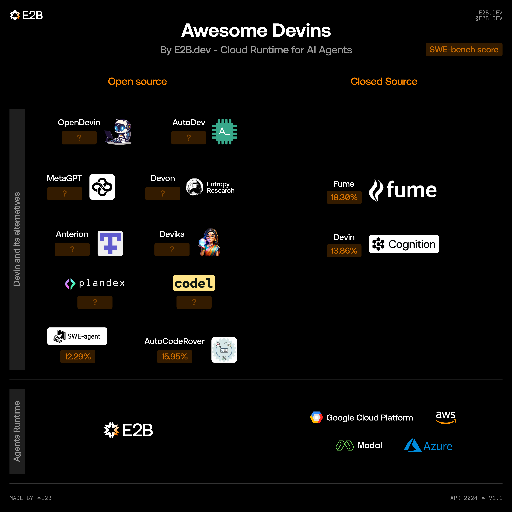

<h1 align="center">
	🔮 Awesome Devins
	

		
		
	

</h1>
<h3 align="center">
  Try out E2B's <a href="https://e2b.dev/docs?ref=awesome-sdks">cloud runtime</a> for AI agents
</h3>

<h5 align="center">🌟 <a href="https://e2b.dev/ai-agents">See this list in web UI</a></h5>

<h5 align="center">👉 <a href="https://forms.gle/UXQFCogLYrPFvfoUA">Submit new product here</a></h5>

Welcome to our list of AI agents that are inspired by release of Devin. See the 🌟 [complete list of AI agents](https://e2b.dev/ai-agents). 🌟

The list is done according to our best knowledge, although definitely not comprehensive. Check out also <a href="https://github.com/e2b-dev/awesome-sdks-for-ai-agents">the Awesome List of SDKs for AI Agents</a>.
Discussion and feedback appreciated! :heart:

Have anything to add? Create a pull request or fill in this [form](https://forms.gle/UXQFCogLYrPFvfoUA). Please keep the alphabetical order and in the correct category.

<!---
## Who's behind this?
This list is made by the team behind [e2b](https://github.com/e2b-dev/e2b). E2b is building AWS for AI agents. We help developers to deploy, test, and monitor AI agents. E2b is agnostic to your tech stack and aims to work with any tooling for building AI agents.
--->

## Want to use E2B with your AI product?
Contact us at [hello@e2b.dev](mailto:hello@e2b.dev) or [on Discord](https://discord.gg/35NF4Y8WSE). Follow us on [X (Twitter)](https://twitter.com/e2b_dev)

We are open-source and you can get started with E2B [here](https://e2b.dev/docs?ref=awesome-sdks).

<!---
## Join the community
- Follow us on [Twitter](https://twitter.com/e2b_)
- [Join Twitter community](https://twitter.com/i/communities/1670204079619055616) for AI agents
- [Join our Discord](https://discord.gg/U7KEcGErtQ)

Feel free to reach out to us at [hello@e2b.](mailto:hello@e2b.).
--->

# Open-source "Devins"

## [Devika](https://github.com/stitionai/devika)
Agentic AI Software Engineer

### Category
Coding, general purpose

### Description
- Devika is an Agentic AI Software Engineer that can understand high-level human instructions, break them down into steps, research relevant information, and write code to achieve the given objective.
- Devika aims to be a competitive open-source alternative to Devin by Cognition AI.

### Links
- [GitHub](https://github.com/stitionai/devika)

## [Devon](https://github.com/entropy-research/Devon)
Open-source Devin alternative

### Category
Coding, general purpose

### Description
- Open-source alternative to Devin by Entropy research

### Links
- [GitHub](https://github.com/entropy-research/Devon)

## [MetaGPT](https://github.com/geekan/MetaGPT)
Agent framework returning Design, Tasks, or Repo

 

### Category
Multi-agent, Coding, Build your own

### Description
MetaGPT is a multi-agent framework that, given one line requirement, returns PRD, Design, Tasks, or Repo.
- MetaGPT allows to assign different roles to GPTs to form a collaborative software entity for complex tasks
- It takes a one line requirement as input and outputs user stories / competitive analysis / requirements / data structures / APIs / documents, etc.
- Internally, MetaGPT includes product managers / architects / project managers / engineers
- It provides the entire process of a software company along with carefully orchestrated SOPs. Code = SOP(Team) is the core philosophy
- The paper about LLM-based multi-agent work spushes forward the idea of autonomous agents collaborating with each other to do more than one can on its own.
- MetaGPT incorporates efficient human workflows as a meta programming approach into LLM-based multi-agent collaboration

### Links  
- [GitHub](https://github.com/geekan/MetaGPT)
- [Discord](https://discord.com/invite/4WdszVjv)
- [Twitter](https://twitter.com/DeepWisdom2019)
- [Paper - MetaGPT: Meta Programming for Multi-Agent Collaborative Framework](https://arxiv.org/abs/2308.00352)

## [OpenDevin](https://github.com/OpenDevin/OpenDevin)
OpenDevin: Code Less, Make More

### Category
Coding, general purpose

### Description
-  The OpenDevin project is born out of a desire to replicate, enhance, and innovate beyond the original Devin model.
-  By engaging the open-source community, we aim to tackle the challenges faced by Code LLMs in practical scenarios, producing works that significantly contribute to the community and pave the way for future advancements.

### Links
- [GitHub](https://github.com/OpenDevin/OpenDevin)

# Closed-source "Devins"

## Want to use E2B with your AI product?
Contact us at [hello@e2b.dev](mailto:hello@e2b.dev) or [on discord](https://discord.gg/35NF4Y8WSE).

We are open-source and you can get started with E2B [here](https://e2b.dev/docs?ref=awesome-sdks).

## Join the community
- Follow us on [X ](https://twitter.com/e2b_dev)
- [Hit us up on discord](https://discord.gg/35NF4Y8WSE)
- Feel free to reach out to us at [hello@e2b.dev](mailto:hello@e2b.dev).
